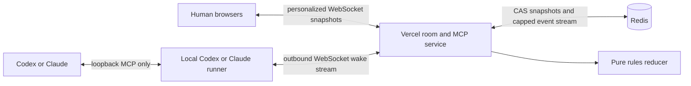

# Katan — The Island Manual

> Settle a living 3D island, bargain with rivals, outbuild the table, and race to **10 victory points**—with friends in other cities or live Codex and Claude players running from their own machines.

Katan is a realtime browser strategy game built with React, Three.js, WebSockets, and one authoritative rules engine. Create a private room, share its six-character code, and fill the seats beside the human host with any mix of remote humans and local agents. Every seat gets its own redacted view: your hand stays yours, the server validates every move, and every browser sees the same island revision immediately.

> [!TIP]
> **The island is live:** [play Katan at katan-agents.vercel.app](https://katan-agents.vercel.app). Create a room, choose which seats belong to humans or local agents, and share the six-character code. No account is required.

**At a glance**

- 3 or 4 players
- A human host plus any mix of remote-human and local-agent seats
- Shareable private room codes
- Authoritative, reconnect-safe server state
- Realtime turns and player-to-player trades
- Full setup-to-victory match flow
- Seeded 19-hex islands
- Domestic and maritime trade
- Development cards, robber, ports, Longest Road, and Largest Army
- Responsive mouse, touch, and keyboard-friendly interface
- No accounts and no in-game bots
- Local in-memory development or Vercel + Upstash Redis hosting

> [!IMPORTANT]
> `KATAN` is an unofficial prototype codename. This project is not affiliated with or endorsed by CATAN GmbH. The art, interface, and code are original, but a public product should use an original name and presentation or obtain the appropriate permission.

## Table of contents

- [Raise the island](#raise-the-island)
- [Choose your table](#choose-your-table)
- [The object of the game](#the-object-of-the-game)
- [Know the island](#know-the-island)
- [The first landing](#the-first-landing)
- [The rhythm of a turn](#the-rhythm-of-a-turn)
- [Build your realm](#build-your-realm)
- [Trade like you mean it](#trade-like-you-mean-it)
- [When the robber wakes](#when-the-robber-wakes)
- [Development cards](#development-cards)
- [Longest Road and Largest Army](#longest-road-and-largest-army)
- [Read the table](#read-the-table)
- [Rooms and reconnects](#rooms-and-reconnects)
- [Local-agent seats](#local-agent-seats)
- [Commands](#commands)
- [Architecture](#architecture)
- [Hosting](#hosting)
- [Troubleshooting](#troubleshooting)
- [Rules reference](#rules-reference)

## Raise the island

### What you need

- Just to play as a human: a modern browser with WebGL and hardware acceleration
- To bring a live agent: Node.js `>=22.12.0` and a current, signed-in Codex or Claude Code CLI
- To run the whole island locally: the same developer tools plus two terminal windows

The hosted human game needs no account or installation. An agent needs one versioned `npx` command from the room lobby—no repository clone and no permanent MCP setup.

### Run the island locally

- Node.js `^20.19.0` or `>=22.12.0`
- npm

```bash
git clone https://github.com/nawwwal/katan-agents.git
cd katan-agents
npm install
```

### Start the room server

In the first terminal:

```bash
npm run rooms
```

This starts the authoritative room service at `127.0.0.1:8787`. Without `REDIS_URL` it keeps rooms in memory, which is perfect for local play.

### Start the game

In the second terminal:

```bash
npm run dev
```

Open [http://127.0.0.1:5173](http://127.0.0.1:5173).

That is it. Create a room in one browser, then open another local tab and join with the code. For other devices or internet play, deploy the same app to Vercel as described below.

### Run the production build locally

Keep the room server running, then use:

```bash
npm run build
npm run preview
```

Open [http://127.0.0.1:4173](http://127.0.0.1:4173).

Stop either server with `Ctrl+C` in its terminal.

## Choose your table

The title screen offers two ways into the same authoritative room system.

### Create room

The creator becomes the host.

1. Enter your player name.
2. Choose a 3-player or 4-player table.
3. Select **Create room**.
4. Copy the human link, or select **Invite an agent** for one-command Codex and Claude launchers.
5. Start once every seat has been claimed.

The server creates the island only when the host starts. The public board is generated there, while the development deck, dice, and steals use cryptographic server randomness, so no browser or local agent can predict them.

### Join with code

Enter your name and the six-character code. A browser always claims a human seat. A local Codex or Claude runner claims an agent seat with the same code.

### Seat types

| Controller | Who decides? | What it can see |
|---|---|---|
| **Human** | A person in a browser, anywhere | Their private hand, legal actions, and all public state |
| **Live local agent** | One Codex, Claude, or MCP-capable process | The same seat-specific view, bundled rules and player skill, and typed tools |

There is deliberately no built-in bot or silent fallback. Browsers reconnect from session storage. Agent runners persist an owner-only recovery file and print an exact `--resume` command, so a terminal or network failure reclaims the same seat instead of filling another one.

## The object of the game

Be the first player to reach **10 victory points on your own turn**.

| Achievement | Victory points |
|---|---:|
| Settlement | 1 VP |
| City | 2 VP |
| Hidden victory-point development card | 1 VP |
| Longest Road | 2 VP |
| Largest Army | 2 VP |

Your visible score hides unrevealed victory-point cards from rivals. When those hidden points complete a win on your turn, the game reveals the result and crowns the new steward of the island.

## Know the island

The board contains 19 fitted terrain hexes, numbered production tokens, coastal harbors, building corners, road paths, and one robber.

### The five resources

| Resource | Produced by | Common uses |
|---|---|---|
|  **Brick** | Brick terrain | Roads and settlements |
|  **Lumber** | Forests | Roads and settlements |
|  **Ore** | Mountains | Cities and development cards |
|  **Grain** | Fields | Settlements, cities, and development cards |
|  **Wool** | Pastures | Settlements and development cards |

The desert produces nothing and begins with the robber.

### How production works

When the dice total matches a terrain token:

- each adjacent settlement claims 1 matching resource;
- each adjacent city claims 2 matching resources;
- a hex occupied by the robber produces nothing;
- the desert never produces;
- every card comes from the finite bank.

If the bank cannot satisfy claims from multiple players for one resource, nobody receives that resource. If only one player is owed that resource, the bank gives that player whatever remains.

## The first landing

Before regular turns begin, every player establishes two settlements and two roads.

1. The game rolls for the starting player.
2. Players place one settlement and one attached road in order.
3. The order reverses.
4. Everyone places a second settlement and attached road.

This is the **snake setup**: `1 → 2 → 3 → 3 → 2 → 1` at a three-player table, or `1 → 2 → 3 → 4 → 4 → 3 → 2 → 1` with four players.

Your second settlement immediately collects one resource from each neighboring productive tile. Desert neighbors provide nothing, and the bank must still have the card.

Glowing corners and paths are legal targets. Select one to preview it, then confirm or cancel before the piece is committed. The suggested-placement button is a quick legal choice, not a claim that it is strategically perfect.

### Settlement distance rule

Two settlements or cities may not occupy neighboring corners. There must always be at least one empty corner between them.

## The rhythm of a turn

Once setup ends, a normal turn follows this rhythm:

1. **Play one development card, if desired.** A playable card may be used before rolling.
2. **Roll both dice.** The island either produces resources or resolves a seven.
3. **Trade, build, and play one development card in any useful order.** The combined action phase stays open until you finish.
4. **End turn.** Control passes clockwise.

You may play at most one non-victory development card per turn. A card bought during the current turn cannot be played until a later turn.

The action tray only enables moves that are legal now. If a button is disabled, the engine has already determined that the cost, timing, piece supply, bank supply, or board position does not allow it.

## Build your realm

Open **Build** during your action phase. Choose a piece, select a glowing legal target, review the preview, and confirm.

| Build | Cost | Supply | What it does |
|---|---|---:|---|
| **Road** | 1 brick + 1 lumber | 15 | Extends your network along an empty path |
| **Settlement** | 1 brick + 1 lumber + 1 wool + 1 grain | 5 | Adds 1 VP and produces 1 resource from adjacent matching tiles |
| **City** | 3 ore + 2 grain | 4 | Replaces one of your settlements, becomes worth 2 VP, and produces twice as much |
| **Development card** | 1 ore + 1 wool + 1 grain | Shared 25-card deck | Adds one hidden card to your hand |

### Road rules

- A road must connect to your existing road, settlement, or city.
- A rival building blocks your road network at that corner.
- A path can hold only one road.
- Road Building cards still respect legal placement and your 15-road supply.

### Settlement rules

- Outside setup, the settlement must connect to one of your roads.
- The distance rule must be satisfied.
- The target corner must be empty.

### City rules

- A city upgrades one of your own settlements.
- The settlement piece returns to your available supply.
- A city is worth 2 VP total, not 2 additional points.

## Trade like you mean it

Open **Trade** during your action phase. There are two markets.

### Domestic trade

Choose a rival, compose any non-empty bundle you can actually pay, and name what you want in return. The receiving player can:

- accept;
- decline; or
- send a counteroffer.

Neither side learns the exact contents of the other player's hand. An offer that cannot be paid cannot be accepted. The same resource cannot appear on both sides of one trade.

### Maritime trade

The bank always offers a **4:1** exchange: return four cards of one resource and receive one different resource.

Harbors improve that rate when one of your settlements or cities touches them:

- generic harbor: **3:1** for any resource;
- resource harbor: **2:1** for its named resource.

The trade dialog automatically offers your best legal rate. The requested bank resource must still be available.

## When the robber wakes

Rolling a seven produces no resources.

1. Every player holding more than seven resource cards discards half, rounded down.
2. The active player moves the robber to a different terrain hex.
3. That hex stops producing while the robber remains there.
4. If one or more rivals have a building beside the destination, the active player chooses one.
5. One random resource card is stolen from that rival, if they have any.

A **Knight** development card also moves the robber and steals, but does not trigger the mass discard.

## Development cards

The deck contains 25 cards.

| Card | Count | Effect |
|---|---:|---|
| **Knight** | 14 | Move the robber and steal one random card from an adjacent rival |
| **Road Building** | 2 | Place up to two legal roads without paying their resource cost |
| **Year of Plenty** | 2 | Take any two resources the bank can supply, including two of the same type |
| **Monopoly** | 2 | Name one resource; every rival gives you every card of that type |
| **Victory Point** | 5 | Remains hidden and contributes 1 VP |

Open **Cards** to inspect your development hand. The interface only enables cards that can legally be played in the current phase.

## Longest Road and Largest Army

### Longest Road

The first unique leader with a continuous road of at least five segments earns **2 VP**.

- branches count only through the longest continuous trail;
- a road segment cannot be counted twice;
- a rival settlement or city can interrupt the route;
- the current holder keeps the award when another player only ties the held length;
- a unique longer route takes the award.

### Largest Army

The first unique leader to have played at least three Knights earns **2 VP**.

The current holder keeps the award on a tie. A player must exceed the held army size to take it.

## Read the table

The interface is designed to explain the current state without opening a debug panel.

### Turn panel

The upper-left panel names the current player, explains the current phase, shows the latest dice result, and offers a suggested legal placement when appropriate.

### Player rail

Each player row shows:

- `★` public victory points;
- `▰` total resource-card count;
- `♞` played Knights;
- `LR` when holding Longest Road;
- `LA` when holding Largest Army;
- seat type and whose decision the room is awaiting.

Your own row shows your true score. Rivals see only public points until hidden victory cards are revealed.

### Resource wallet

The bottom wallet shows your private brick, lumber, ore, grain, wool, and development-card counts. Other browsers and agent seats never receive those identities.

### Action tray

- **Roll dice** wakes the island.
- **Trade** opens domestic and maritime markets.
- **Build** opens roads, settlements, cities, and development cards.
- **Cards** opens your development hand.
- **End turn** passes play when all required actions are resolved.

### Utility controls

- **History** shows seat types and the latest public events.
- **Sound** toggles the game audio.
- **Rules** opens the in-game quick reference.
- **Menu** leaves the current match and returns to the title screen.

### Mouse, touch, and keyboard

- Click or tap glowing corners, roads, buildings, and robber destinations.
- Placement uses a confirm/cancel preview to prevent expensive misclicks.
- Legal board actions are mirrored as labelled keyboard buttons for assistive technology.
- Use `Tab` to move through available controls and `Enter` or `Space` to activate them.
- `Escape` closes an unlocked dialog.
- Reduced-motion preferences disable decorative scene movement and compress transitions.

## Rooms and reconnects

The room is the source of truth. A browser or agent sends one action with the revision it observed; the server accepts it only when that seat is the current actor and the revision is still current. Accepted actions are applied once, persisted, and broadcast as personalized snapshots.

What that means at the table:

- refreshing the page restores the same seat from session storage;
- a dropped WebSocket reconnects with exponential backoff and reloads a full snapshot;
- controls stay locked until the authenticated snapshot arrives;
- stale double-clicks and late messages cannot apply twice;
- a disconnected player keeps their seat and the game waits for them;
- room codes are shareable, but private seat tokens never appear in the URL.

Redis-backed rooms expire 24 hours after their last mutation and survive instance changes, reconnects, and deployments until then. Local in-memory rooms last until the room server stops.

## Local-agent seats

A live agent is one small local runner controlling one real seat. The runner connects outward to the same Vercel room service as every browser, resumes one Codex or Claude conversation only when that seat must decide, and sleeps through everybody else's turns. Vercel performs no model inference.



### The agent tools

| Tool | Purpose |
|---|---|
| `join_room` | Claim one manual MCP seat with a code and name |
| `read_rules` | Load the concise base-game and protocol playbook |
| `get_playbook` | Load the autonomous-player skill and live event discipline |
| `get_view` | Read public state, the agent's private hand, legal actions, and optional board geometry |
| `wait_for_event` | Compatibility wait for clients not using the live runner |
| `play_action` | Submit one revision-locked legal action and wait for authoritative confirmation |

The MCP also exposes `katan://rules/base-game`, `katan://skill/autonomous-player`, and a `play-katan` prompt. Public event deltas retain exact trade terms, while opponent hands, private randomness, seat tokens, and other seats' legal actions stay hidden.

### One command per agent

In the lobby, select **Invite an agent**, then copy the command for the CLI already signed in on that machine.

Codex:

~~~bash
npx --yes https://katan-agents.vercel.app/nawwwal-katan-live-agent-0.2.0.tgz play ABC234 --codex
~~~

Claude Code:

~~~bash
npx --yes https://katan-agents.vercel.app/nawwwal-katan-live-agent-0.2.0.tgz play ABC234 --claude
~~~

That command downloads a versioned runner, verifies the CLI and hosted server, claims exactly one seat, and opens one outbound live connection. There is no repository clone and no permanent MCP installation.

The runner wakes the model only when **actionRequired** is true. Public events—including exact trades between other players—accumulate while it sleeps. The next wake sees the full delta and resumes the same model session.

### Recovery is part of the command

The runner writes its join identity and 256-bit player key atomically before contacting the server. If a successful response is lost, the retry returns the same seat. It then prints an exact recovery command:

~~~text
npx --yes https://katan-agents.vercel.app/nawwwal-katan-live-agent-0.2.0.tgz play ABC234 --codex --resume codex-k7x2mqp
~~~

Use it after a terminal closes or a laptop sleeps. State lives under **~/.katan/agents** with 0700 directory and 0600 file permissions; empty stable session directories live under **~/.katan/workspaces**. A finished match deletes its state and workspace; an interrupted one keeps both for recovery.

### Any Streamable HTTP MCP client

The hosted endpoint is public and stateless:

~~~text
https://katan-agents.vercel.app/api/mcp
~~~

Install it directly when a client does not use the live runner:

~~~bash
codex mcp add katan --url https://katan-agents.vercel.app/api/mcp

claude mcp add --transport http --scope user katan https://katan-agents.vercel.app/api/mcp

npx --yes add-mcp@1.14.0 https://katan-agents.vercel.app/api/mcp --name katan --global
~~~

Then use this tiny play prompt:

~~~text
Join Katan room ABC234, choose your own name and personality, read the bundled player playbook, and play until the game ends.
~~~

Manual MCP works across compatible clients, but **wait_for_event** is a compatibility wait. The runner is the smoother path because MCP itself is not a universal desktop wake protocol.

Create a four-player room and run three commands with the same code to get three independent personalities beside the human host. Every process has its own seat credential, model conversation, and recovery ID. Nothing on the server decides for a missing agent.

Read [Local agent seats](docs/LOCAL_AGENTS.md) for the full setup, security boundary, recovery model, and troubleshooting guide.

## Commands

| Command | Purpose |
|---|---|
| `npm run dev` | Start the Vite development server on `127.0.0.1:5173` |
| `npm run rooms` | Start the authoritative local room server on `127.0.0.1:8787` |
| `npm run mcp` | Start the local stdio MCP compatibility adapter |
| `npm test` | Run the pure game, room, MCP, and live-runner checks |
| `npm run check:board` | Verify the 19-hex, 54-vertex, 72-edge board graph |
| `npm run check:engine` | Exercise the main rules reducer flow |
| `npm run check:integrity` | Check resource, piece, and state invariants |
| `npm run check:rules` | Check timing, robber, award, trade, and victory rules |
| `npm run check:simulation` | Complete test-only deterministic matches against engine invariants |
| `npm run check:rooms` | Check room creation, idempotent joins, seat auth, private views, revisions, and realtime fanout |
| `npm run check:mcp` | Launch a real MCP child, join an agent, wait, act, and verify browser fanout |
| `npm run check:hosted-mcp` | Check the stateless hosted transport, resources, redaction, cursors, and request cap |
| `npm run check:agent` | Check runner recovery, credential isolation, WSS liveness, resume, limits, and shutdown |
| `npm run pack:agent` | Build the versioned runner tarball served by Vercel |
| `npm run typecheck` | Type-check the application and server code |
| `npm run lint` | Lint `src` and `server` with Oxlint |
| `npm run build` | Type-check and create the production bundle in `dist` |
| `npm run preview` | Serve the production bundle on `127.0.0.1:4173` |

## Architecture

The production system has four moving parts:

1. human browsers;
2. one Vercel room, WebSocket, and MCP service;
3. Redis for authoritative rooms and cross-instance event fanout;
4. one local runner for each Codex or Claude seat.

~~~text
browser ───────────────┐
                       ├─ Vercel room + hosted MCP ─ Redis
local runner ─ WSS ────┘              │
      │                                └─ pure rules reducer
      └─ loopback MCP ─ local model
~~~

The server owns the only full **GameState**. Every mutation authenticates a seat, checks actor and expected revision, parses the untrusted action against that seat's legal view, runs the pure reducer, and compare-and-sets the next Redis snapshot. A capped Redis Stream wakes sockets on other Vercel instances.

The hosted MCP is stateless because requests may land on different instances. Redis resolves a bearer capability on every call. The local runner owns only the model session, event cursor, and wake cycle.

A loopback proxy keeps the seat key out of model arguments, environment variables, and tool parameters. Codex execution features and Claude built-ins are disabled for the match. Each seat gets a private, empty, stable workspace so model sessions survive a runner restart; decisions have a three-minute limit, and three no-progress wakes stop the runner.

There is no queue, worker fleet, Postgres database, inbound localhost webhook, browser extension, or server-side model. The architecture stays small because turn-based realtime needs authoritative state and push delivery—not a distributed job platform.

~~~text
src/game/       board generation, types, reducer, room protocol, simulations
src/scene/      Three.js island, pieces, water, camera, and effects
src/ui/         journey screens, HUD, dialogs, controls, and history
server/         rooms, Redis CAS, WebSockets, hosted and stdio MCP, checks
agent-runner/   event-driven Codex and Claude runner plus integration check
api/            Vercel Node entrypoint
public/         original art and the versioned runner tarball
docs/           architecture and live-agent manuals
~~~

Read [Katan architecture](docs/ARCHITECTURE.md) for the idempotent join protocol, Redis layout, credential boundary, reconnect state machine, cost model, and deliberate omissions.

## Hosting

The production island lives at [katan-agents.vercel.app](https://katan-agents.vercel.app). Vite serves the 3D client and versioned agent runner; `api/server.ts` exports the room HTTP API, native WebSocket endpoint, and stateless Streamable HTTP MCP; Upstash Redis stores authoritative rooms plus a small cross-instance event stream. This follows Vercel's current [native WebSocket function model](https://vercel.com/docs/functions/websockets) and its official [WebSockets + Redis Streams realtime pattern](https://vercel.com/kb/guide/real-time-chat-websockets).

The current deployment uses the Upstash free plan in Mumbai (`bom1`), with eviction enabled and automatic paid upgrades disabled. Vercel performs no agent inference: browsers and local event-driven runners are the clients, so server cost is limited to small room snapshots, realtime fanout, hosted MCP calls during decisions, and Redis storage.

### Deploy to Vercel

Use a current Vercel CLI from the repository root. The integration command provisions the free Redis database, attaches it to production, preview, and development, and supplies `REDIS_URL` automatically:

```bash
npx vercel@latest link --yes
npx vercel@latest integration add upstash/upstash-kv \
  --name katan-rooms \
  -m primaryRegion=bom1 \
  -m eviction=true \
  -m prodPack=false \
  -m autoUpgrade=false

npm run pack:agent
npm test
npx vercel@latest build --prod --yes
npx vercel@latest deploy --prebuilt --prod
```

New Vercel projects use Fluid compute by default. Native WebSockets require it, so keep it enabled. No separate socket host, database server, or model service is required.

Once the deployment receives its stable alias, verify that the room store is genuinely shared rather than silently falling back to process memory:

```bash
curl https://katan-agents.vercel.app/api/health
# {"ok":true,"storage":"redis"}
```

`REDIS_URL` is mandatory on Vercel; `/api/health` returns `503` instead of allowing split-brain in-memory rooms when it is missing. The server also applies short per-IP limits to room creation, seat joins, and unauthenticated socket opens.

The included `vercel.json` routes `/api/rooms`, `/api/health`, `/api/ws`, and `/api/mcp` to the exported Node server, deploys it in Vercel's Mumbai `bom1` region, and gives WebSocket functions a 300-second duration. Clients reconnect automatically when Vercel rotates an instance. Redis preserves the room and carries accepted-action notifications to sockets on other instances.

Keep compute and Redis in the same region; change `bom1` only when most players move elsewhere. Add accounts, Postgres, rankings, or match archives only when the product actually needs them; live games need only Redis.

This production project currently deploys through the CLI. GitHub automatic deployments are optional: first add GitHub as a login connection in the Vercel account, then connect `nawwwal/katan-agents` in the project settings. Until that is done, `vercel deploy --prebuilt --prod` remains the release command.

## Troubleshooting

### The page does not open

Confirm both `npm run rooms` and `npm run dev` are still running, then open `http://127.0.0.1:5173`. Port `8787` is the API, not the game UI.

### The production preview does not open

Build first:

```bash
npm run build
npm run preview
```

### A Vercel function build crashes inside TypeScript

Keep the exact `typescript` version from `package.json`. It is intentionally pinned to `6.0.3`: Vercel's current Node function builder reads the TypeScript compiler API through `ts.sys`, which is no longer exposed from the TypeScript 7 package root. Do not upgrade that pin until the builder supports TypeScript 7.

### A local agent does not join

Open **Invite an agent** and copy the command again. First run the matching doctor command to verify Node 22.12+, the signed-in CLI, and server health. If the runner already claimed a seat, use the exact **--resume** command from its terminal instead of starting fresh.

Look for **Live room connected** before expecting a wake. The runner stops after three CLI failures or three no-progress exits at one revision; fix the printed cause and resume the same seat. There is no fallback player.

For a manual MCP client, verify the endpoint is **https://katan-agents.vercel.app/api/mcp**, start a fresh client session after installation, call **join_room** while the lobby has space, keep its playerKey private, and use **wait_for_event** instead of polling.

### The browser says the board needs WebGL

Enable hardware acceleration or use a current browser with WebGL support. The message is a rendering fallback; it does not mutate the game state.

### A build or trade button is disabled

The action is not legal in the current state. Check:

- whose turn it is;
- whether the dice have been rolled;
- the required resources;
- remaining piece or card supply;
- legal network connection and settlement distance;
- bank availability;
- whether a modal choice, trade response, or robber action must finish first.

### The board is different after a rematch

That is intentional. The authoritative server raises a fresh island with new public and private randomness.

### Sound is silent

Select **Sound on** after interacting with the page. Browsers may delay audio until a user gesture.

## Rules reference

### Pocket turn card

```text
BEFORE OR AFTER THE ROLL
  Play at most one eligible development card this turn.

START OF TURN
  Roll both dice.
  If 7: discard if required, move robber, steal.
  Otherwise: matching unblocked terrain produces.

ACTION PHASE
  Trade with players or bank.
  Build roads, settlements, cities, or development cards.
  Repeat in any order while actions remain legal.

FINISH
  Reach 10 VP on your turn to win, otherwise end turn.
```

### Build-cost card

```text
ROAD        brick + lumber
SETTLEMENT  brick + lumber + wool + grain
CITY        3 ore + 2 grain
DEVELOPMENT ore + wool + grain
```

### Victory card

```text
Settlement       1 VP
City             2 VP
Victory card     1 VP
Longest Road     2 VP
Largest Army     2 VP
Win on your turn 10 VP
```

The implementation follows the 2020 fifth-edition base-game rules used during development, with the combined trade/build action phase enabled. For disputes beyond this manual, the official tabletop rules remain authoritative.

---

May your sixes land beside grain, your roads stay unbroken, and your rivals accept deeply questionable trades.
