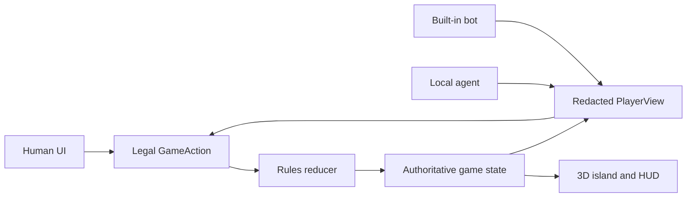

# Katan — The Island Manual

> Settle a living 3D island, bargain with rivals, outbuild the table, and race to **10 victory points**. Play yourself, invite built-in bots, give seats to local AI agents, or pour a drink and spectate the whole contest.

Katan is a local-first browser strategy game built with React, Three.js, and one rules engine shared by every kind of player. Human clicks, bot choices, and external-agent decisions all become the same validated game actions. The island is fully interactive, the board is seeded, private hands stay private, and every public move is preserved in the match history.

**At a glance**

- 3 or 4 players
- Human, built-in bot, and local-agent seats
- Full setup-to-victory match flow
- Seeded 19-hex islands
- Domestic and maritime trade
- Development cards, robber, ports, Longest Road, and Largest Army
- Pausable agent-only spectator matches
- Responsive mouse, touch, and keyboard-friendly interface
- No account, cloud service, or database required

> [!IMPORTANT]
> `KATAN` is an unofficial prototype codename. This project is not affiliated with or endorsed by CATAN GmbH. The art, interface, and code are original, but a public product should use an original name and presentation or obtain the appropriate permission.

## Table of contents

- [Raise the island](#raise-the-island)
- [Choose your table](#choose-your-table)
- [The object of the game](#the-object-of-the-game)
- [Know the island](#know-the-island)
- [The first landing](#the-first-landing)
- [The rhythm of a turn](#the-rhythm-of-a-turn)
- [Build your realm](#build-your-realm)
- [Trade like you mean it](#trade-like-you-mean-it)
- [When the robber wakes](#when-the-robber-wakes)
- [Development cards](#development-cards)
- [Longest Road and Largest Army](#longest-road-and-largest-army)
- [Read the table](#read-the-table)
- [Spectator mode](#spectator-mode)
- [Local-agent seats](#local-agent-seats)
- [Commands](#commands)
- [Architecture](#architecture)
- [Hosting](#hosting)
- [Troubleshooting](#troubleshooting)
- [Rules reference](#rules-reference)

## Raise the island

### What you need

- Node.js `^20.19.0` or `>=22.12.0`
- npm
- A modern browser with WebGL and hardware acceleration
- Two terminal windows if the table contains a local-agent seat

### Clone and install

```bash
git clone https://github.com/nawwwal/katan-agents.git
cd katan-agents
npm install
```

### Start the agent bridge

In the first terminal:

```bash
npm run bridge
```

This starts the fast offline heuristic bridge at `127.0.0.1:8787`. It is deterministic, needs no model credentials, and is the easiest way to use a **Local agent** seat.

### Start the game

In the second terminal:

```bash
npm run dev
```

Open [http://127.0.0.1:5173](http://127.0.0.1:5173).

That is it. No account creation, database migration, environment file, or cloud project stands between you and the island.

### Run the production build locally

Keep the bridge running, then use:

```bash
npm run build
npm run preview
```

Open [http://127.0.0.1:4173](http://127.0.0.1:4173).

Stop either server with `Ctrl+C` in its terminal.

## Choose your table

The title screen offers two ways into the game.

### Start game

Use this when you want to play.

1. Choose a 3-player or 4-player table.
2. Give every seat a name.
3. Assign each seat a controller.
4. Enter an island seed from `1` to `999999`.
5. Select **Create island**.
6. Review the placement order, then select **Enter the island**.

A playable table contains exactly one **Human** seat. Every other seat can be a built-in bot or local agent.

### Watch agents

Use this when you want the table to play itself.

Every seat is automated. You can pause the match, change its pace, inspect the public timeline, watch agent decisions arrive, and follow the game all the way to the final standings.

### Controller types

| Controller | Who decides? | What it can see |
|---|---|---|
| **Human** | You, on this device | Your private hand and all public state |
| **Built-in bot** | The in-browser deterministic bot | A redacted player view and its legal actions |
| **Local agent** | A process behind the local bridge | The same redacted view, including only its own private hand |

The island seed reproduces the public board and setup order. Dice, the development deck, and random steals use a separate private random seed, so a shared board seed does not reveal future hidden outcomes.

## The object of the game

Be the first player to reach **10 victory points on your own turn**.

| Achievement | Victory points |
|---|---:|
| Settlement | 1 VP |
| City | 2 VP |
| Hidden victory-point development card | 1 VP |
| Longest Road | 2 VP |
| Largest Army | 2 VP |

Your visible score hides unrevealed victory-point cards from rivals and spectators. When those hidden points complete a win on your turn, the game reveals the result and crowns the new steward of the island.

## Know the island

The board contains 19 fitted terrain hexes, numbered production tokens, coastal harbors, building corners, road paths, and one robber.

### The five resources

| Resource | Produced by | Common uses |
|---|---|---|
|  **Brick** | Brick terrain | Roads and settlements |
|  **Lumber** | Forests | Roads and settlements |
|  **Ore** | Mountains | Cities and development cards |
|  **Grain** | Fields | Settlements, cities, and development cards |
|  **Wool** | Pastures | Settlements and development cards |

The desert produces nothing and begins with the robber.

### How production works

When the dice total matches a terrain token:

- each adjacent settlement claims 1 matching resource;
- each adjacent city claims 2 matching resources;
- a hex occupied by the robber produces nothing;
- the desert never produces;
- every card comes from the finite bank.

If the bank cannot satisfy claims from multiple players for one resource, nobody receives that resource. If only one player is owed that resource, the bank gives that player whatever remains.

## The first landing

Before regular turns begin, every player establishes two settlements and two roads.

1. The game rolls for the starting player.
2. Players place one settlement and one attached road in order.
3. The order reverses.
4. Everyone places a second settlement and attached road.

This is the **snake setup**: `1 → 2 → 3 → 3 → 2 → 1` at a three-player table, or `1 → 2 → 3 → 4 → 4 → 3 → 2 → 1` with four players.

Your second settlement immediately collects one resource from each neighboring productive tile. Desert neighbors provide nothing, and the bank must still have the card.

Glowing corners and paths are legal targets. Select one to preview it, then confirm or cancel before the piece is committed. The suggested-placement button is a quick legal choice, not a claim that it is strategically perfect.

### Settlement distance rule

Two settlements or cities may not occupy neighboring corners. There must always be at least one empty corner between them.

## The rhythm of a turn

Once setup ends, a normal turn follows this rhythm:

1. **Play one development card, if desired.** A playable card may be used before rolling.
2. **Roll both dice.** The island either produces resources or resolves a seven.
3. **Trade, build, and play one development card in any useful order.** The combined action phase stays open until you finish.
4. **End turn.** Control passes clockwise.

You may play at most one non-victory development card per turn. A card bought during the current turn cannot be played until a later turn.

The action tray only enables moves that are legal now. If a button is disabled, the engine has already determined that the cost, timing, piece supply, bank supply, or board position does not allow it.

## Build your realm

Open **Build** during your action phase. Choose a piece, select a glowing legal target, review the preview, and confirm.

| Build | Cost | Supply | What it does |
|---|---|---:|---|
| **Road** | 1 brick + 1 lumber | 15 | Extends your network along an empty path |
| **Settlement** | 1 brick + 1 lumber + 1 wool + 1 grain | 5 | Adds 1 VP and produces 1 resource from adjacent matching tiles |
| **City** | 3 ore + 2 grain | 4 | Replaces one of your settlements, becomes worth 2 VP, and produces twice as much |
| **Development card** | 1 ore + 1 wool + 1 grain | Shared 25-card deck | Adds one hidden card to your hand |

### Road rules

- A road must connect to your existing road, settlement, or city.
- A rival building blocks your road network at that corner.
- A path can hold only one road.
- Road Building cards still respect legal placement and your 15-road supply.

### Settlement rules

- Outside setup, the settlement must connect to one of your roads.
- The distance rule must be satisfied.
- The target corner must be empty.

### City rules

- A city upgrades one of your own settlements.
- The settlement piece returns to your available supply.
- A city is worth 2 VP total, not 2 additional points.

## Trade like you mean it

Open **Trade** during your action phase. There are two markets.

### Domestic trade

Choose a rival, compose any non-empty bundle you can actually pay, and name what you want in return. The receiving player can:

- accept;
- decline; or
- send a counteroffer.

Neither side learns the exact contents of the other player's hand. An offer that cannot be paid cannot be accepted. The same resource cannot appear on both sides of one trade.

### Maritime trade

The bank always offers a **4:1** exchange: return four cards of one resource and receive one different resource.

Harbors improve that rate when one of your settlements or cities touches them:

- generic harbor: **3:1** for any resource;
- resource harbor: **2:1** for its named resource.

The trade dialog automatically offers your best legal rate. The requested bank resource must still be available.

## When the robber wakes

Rolling a seven produces no resources.

1. Every player holding more than seven resource cards discards half, rounded down.
2. The active player moves the robber to a different terrain hex.
3. That hex stops producing while the robber remains there.
4. If one or more rivals have a building beside the destination, the active player chooses one.
5. One random resource card is stolen from that rival, if they have any.

A **Knight** development card also moves the robber and steals, but does not trigger the mass discard.

## Development cards

The deck contains 25 cards.

| Card | Count | Effect |
|---|---:|---|
| **Knight** | 14 | Move the robber and steal one random card from an adjacent rival |
| **Road Building** | 2 | Place up to two legal roads without paying their resource cost |
| **Year of Plenty** | 2 | Take any two resources the bank can supply, including two of the same type |
| **Monopoly** | 2 | Name one resource; every rival gives you every card of that type |
| **Victory Point** | 5 | Remains hidden and contributes 1 VP |

Open **Cards** to inspect your development hand. The interface only enables cards that can legally be played in the current phase.

## Longest Road and Largest Army

### Longest Road

The first unique leader with a continuous road of at least five segments earns **2 VP**.

- branches count only through the longest continuous trail;
- a road segment cannot be counted twice;
- a rival settlement or city can interrupt the route;
- the current holder keeps the award when another player only ties the held length;
- a unique longer route takes the award.

### Largest Army

The first unique leader to have played at least three Knights earns **2 VP**.

The current holder keeps the award on a tie. A player must exceed the held army size to take it.

## Read the table

The interface is designed to explain the current state without opening a debug panel.

### Turn panel

The upper-left panel names the current player, explains the current phase, shows the latest dice result, and offers a suggested legal placement when appropriate.

### Player rail

Each player row shows:

- `★` public victory points;
- `▰` total resource-card count;
- `♞` played Knights;
- `LR` when holding Longest Road;
- `LA` when holding Largest Army;
- controller or local-agent status.

Your own row shows your true score while you are seated. Rivals and spectators see only public points until hidden victory cards are revealed.

### Resource wallet

The bottom wallet shows your private brick, lumber, ore, grain, wool, and development-card counts. It disappears while spectating because spectators receive public state only.

### Action tray

- **Roll dice** wakes the island.
- **Trade** opens domestic and maritime markets.
- **Build** opens roads, settlements, cities, and development cards.
- **Cards** opens your development hand.
- **End turn** passes play when all required actions are resolved.

### Utility controls

- **Spectate** leaves your private seat view and watches public play.
- **Take seat** returns to your human seat without restarting the match.
- **History** shows controller status and the latest public events.
- **Sound** toggles the game audio.
- **Rules** opens the in-game quick reference.
- **Menu** leaves the current match and returns to the title screen.

### Mouse, touch, and keyboard

- Click or tap glowing corners, roads, buildings, and robber destinations.
- Placement uses a confirm/cancel preview to prevent expensive misclicks.
- Legal board actions are mirrored as labelled keyboard buttons for assistive technology.
- Use `Tab` to move through available controls and `Enter` or `Space` to activate them.
- `Escape` closes an unlocked dialog.
- Reduced-motion preferences disable decorative scene movement and compress transitions.

## Spectator mode

Select **Watch agents** on the title screen for a zero-human match, or choose **Spectate** during a human game.

While spectating you can:

- pause and resume automated play;
- choose **Slow**, **Steady**, or **Fast** pacing;
- inspect the public event history;
- monitor bot and local-agent decisions;
- return to your human seat when the match includes one;
- watch the final standings, then rematch on a new seed.

Pausing stops automation and aborts an in-flight local-agent decision. Resuming asks the current controller for a fresh action at the unchanged game revision.

## Local-agent seats

Every controller speaks one language: a validated `GameAction` chosen from a seat-specific `PlayerView`.



### Fast offline agent

```bash
npm run bridge
```

This bridge chooses a legal action with the included deterministic heuristic.

### Verified Codex agent

With an authenticated Codex CLI `0.144.0` or newer on `PATH`:

```bash
npm run bridge:codex
```

The adapter requests `gpt-5.6-sol` in an ephemeral, read-only, no-tool environment. It does not silently downgrade the model.

### Bring your own local runner

```bash
KATAN_AGENT_COMMAND=your-agent-cli \
KATAN_AGENT_ARGS='["your", "fixed", "arguments"]' \
npm run bridge
```

The command receives one prompt on standard input and must print one legal action as JSON. The browser cannot choose the executable, arguments, path, model, tokens, or environment.

The bridge:

- binds only to `127.0.0.1:8787`;
- accepts requests only from the local game origin;
- exposes only allowlisted player-view fields;
- never sends another seat's private hand;
- validates the response against current legal actions;
- caps request and process output;
- allows one external decision at a time;
- kills timed-out or cancelled children;
- removes each temporary working directory;
- falls back safely when an agent is unavailable or invalid.

Read [Local agent seats](docs/LOCAL_AGENTS.md) for the full contract and security boundary.

## Commands

| Command | Purpose |
|---|---|
| `npm run dev` | Start the Vite development server on `127.0.0.1:5173` |
| `npm run bridge` | Start the local heuristic/custom-runner bridge on `127.0.0.1:8787` |
| `npm run bridge:codex` | Start the verified Codex-backed bridge |
| `npm test` | Run board, engine, integrity, rules, simulation, and bridge checks |
| `npm run check:board` | Verify the 19-hex, 54-vertex, 72-edge board graph |
| `npm run check:engine` | Exercise the main rules reducer flow |
| `npm run check:integrity` | Check resource, piece, and state invariants |
| `npm run check:rules` | Check timing, robber, award, trade, and victory rules |
| `npm run check:simulation` | Complete deterministic automated matches |
| `npm run check:bridge` | Check bridge origins, redaction, concurrency, aborts, cleanup, and timeouts |
| `npm run typecheck` | Type-check the application and server code |
| `npm run lint` | Lint `src` and `server` with Oxlint |
| `npm run build` | Type-check and create the production bundle in `dist` |
| `npm run preview` | Serve the production bundle on `127.0.0.1:4173` |

## Architecture

The browser owns one authoritative `GameState`. The pure `applyAction` reducer is the only code allowed to change resources, pieces, phases, awards, scores, and the event timeline. Three.js renders that state but does not decide any rule.

```text
src/game/       board generation, types, rules reducer, bots, simulations
src/scene/      Three.js island, pieces, water, camera, and effects
src/ui/         journey screens, HUD, dialogs, controls, and history
src/audio/      procedural interaction and match audio
server/         heuristic, custom-runner, and Codex agent bridges
public/assets/  original terrain and resource artwork
docs/           architecture and local-agent contracts
```

The rules engine exposes legal actions for the current actor. The UI, bot, and external agent choose among those actions; the reducer validates the choice again before applying it. That gives every controller identical rules without trusting any renderer or model.

Read [Katan architecture](docs/ARCHITECTURE.md) for state ownership, redaction, and the hosted-room migration path.

## Hosting

`npm run build` creates a static, root-hosted client suitable for same-device human-versus-bot play. The production bundle currently assumes absolute `/assets` and `/agent-api` paths, so serve it from `/` and provide an equivalent `/agent-api` reverse proxy when using local-agent seats.

There are two important limits:

1. **A public HTTPS page cannot reliably call a loopback HTTP bridge.** Hosted local agents need a signed desktop companion that connects outward to the room service.
2. **A static client cannot run fair multi-browser human rooms.** Each browser would otherwise own private hands. Fair remote rooms need an authoritative server that sends every seat only its redacted player view.

The existing revisioned action contract and pure reducer are the intended boundary for that future room service.

## Troubleshooting

### The page does not open

Confirm `npm run dev` is still running and open `http://127.0.0.1:5173`, not the bridge port.

### The production preview does not open

Build first:

```bash
npm run build
npm run preview
```

### A local-agent seat says disconnected or uses a fallback

Start the bridge in a separate terminal:

```bash
npm run bridge
```

If you are using a custom runner, confirm that it prints exactly one legal JSON action before the 30-second timeout.

### The browser says the board needs WebGL

Enable hardware acceleration or use a current browser with WebGL support. The message is a rendering fallback; it does not mutate the game state.

### A build or trade button is disabled

The action is not legal in the current state. Check:

- whose turn it is;
- whether the dice have been rolled;
- the required resources;
- remaining piece or card supply;
- legal network connection and settlement distance;
- bank availability;
- whether a modal choice, trade response, or robber action must finish first.

### The board is different after a rematch

That is intentional. Rematch increments the island seed and raises a new board.

### Sound is silent

Select **Sound on** after interacting with the page. Browsers may delay audio until a user gesture.

## Rules reference

### Pocket turn card

```text
BEFORE OR AFTER THE ROLL
  Play at most one eligible development card this turn.

START OF TURN
  Roll both dice.
  If 7: discard if required, move robber, steal.
  Otherwise: matching unblocked terrain produces.

ACTION PHASE
  Trade with players or bank.
  Build roads, settlements, cities, or development cards.
  Repeat in any order while actions remain legal.

FINISH
  Reach 10 VP on your turn to win, otherwise end turn.
```

### Build-cost card

```text
ROAD        brick + lumber
SETTLEMENT  brick + lumber + wool + grain
CITY        3 ore + 2 grain
DEVELOPMENT ore + wool + grain
```

### Victory card

```text
Settlement       1 VP
City             2 VP
Victory card     1 VP
Longest Road     2 VP
Largest Army     2 VP
Win on your turn 10 VP
```

The implementation follows the 2020 fifth-edition base-game rules used during development, with the combined trade/build action phase enabled. For disputes beyond this manual, the official tabletop rules remain authoritative.

---

May your sixes land beside grain, your roads stay unbroken, and your rivals accept deeply questionable trades.
