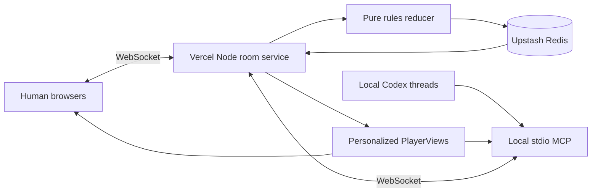

# Katan architecture

## The short version

One Node room service owns every full `GameState`. Humans connect from browsers; local agents connect through the stdio MCP adapter. Both receive a seat-specific `PlayerView`, send the same revisioned `GameAction`, and wait for the server to broadcast the next authoritative snapshot.

There are no in-game bots, no client-side rule authority, and no model calls on Vercel.



## Room lifecycle

1. `POST /api/rooms` creates a 3- or 4-seat lobby and returns the host's opaque seat token.
2. `POST /api/rooms/:code/seats` lets a browser claim a human seat or an MCP process claim an agent seat.
3. Each client opens `/api/ws`, then authenticates in its first `hello` frame. Tokens are never placed in URLs.
4. The host starts when every seat is filled. The server creates the public board and uses cryptographic server randomness for the development deck, dice, and steals.
5. A player sends `{ expectedRevision, requestId, action }` only when their view says they must act.
6. The server authenticates the seat, checks actor and revision, parses the untrusted action, runs `applyAction`, persists the room, and broadcasts personalized snapshots.
7. Finished rooms can be rematched by the host. Inactive rooms expire after 24 hours.

The browser stores its own room credentials in `sessionStorage`. Refreshing reconnects the same seat; sharing `?room=ABC234` shares only the public room code.

## Authority and privacy

`server/room-service.ts` is the state owner. `src/game/engine.ts` remains a pure deterministic reducer, but only the server can call it for a live match.

Every client gets:

- the public board, buildings, roads, bank, phase, awards, dice, and event timeline;
- public card counts and visible scores for every player;
- its own exact resources and development cards;
- legal actions for its own current decision only.

It never gets:

- another seat's resource identities or development-card identities;
- the full development deck;
- the public board seed or private random seed;
- another seat token or another seat's legal actions.

The browser converts `PlayerView` into `GameDisplayState` with empty placeholders for opponent private collections. Public UI must use `resourceCount`, `developmentCount`, and `publicScore` for opponents.

## Action boundary

The WebSocket parser accepts only exact message shapes. The action parser accepts an exact member of `legalActions`, plus two deliberately parameterized cases:

- discards with the exact required total and no more cards than the seat owns;
- domestic offers/counteroffers with valid players, positive disjoint bundles, and an affordable give bundle.

The reducer validates again before changing state. Unknown resources, extra fields, stale revisions, wrong actors, and invented targets fail without mutating the room.

Seat tokens are 256-bit random capabilities and only SHA-256 hashes are stored. Comparisons are timing-safe.

Production randomness is injected by the Node room service from `node:crypto`; the deterministic seed path exists only for repeatable engine checks. Clients cannot supply dice, deck, or steal outcomes.

Unauthenticated sockets have five seconds to send a valid `hello` frame. Before that frame, even `ping` is rejected. Conservative per-IP limits protect room creation, seat joins, and socket opens from accidental or trivial abuse.

## Realtime and Redis

Local development uses the same service with an in-memory store. Production uses `REDIS_URL`:

| Key | Purpose |
|---|---|
| `katan:room:{CODE}` | Serialized authoritative room, seat-token hashes, and game state |
| `katan:room-events` | Capped Redis Stream carrying room-change notifications between Vercel instances |
| `katan:rate:{SCOPE}:{HASH}` | Short-lived create, join, and socket rate counters |

Each mutation reads one room version and uses a Lua compare-and-set to write the next snapshot and stream event atomically only if that observed version is still current. Conflicts retry from fresh state; revision checks make duplicate player actions fail safely. There is no expiring lock that can lose ownership during a runtime pause.

Every function instance uses blocking `XREAD` only while it has authenticated local sockets. An event makes that instance reload the room and send a separately redacted snapshot to each local connection. After a Redis stream interruption, the instance reloads every locally connected room once, so a trimmed notification cannot leave a board stale.

This is intentionally simple. A turn-based four-player game has tiny write contention, so one optimistic room write is cheaper and easier to reason about than a queue or worker fleet.

## Reconnect behavior

Vercel WebSocket functions have a maximum duration, so disconnects are normal:

- browser and MCP clients reconnect with bounded exponential backoff;
- the first authenticated frame reloads a complete snapshot from Redis;
- UI controls remain disabled until that snapshot arrives;
- `expectedRevision` makes a retried or late action harmless;
- a disconnected seat remains reserved and the turn waits.

The server does not guess for a missing agent. Recovery is the same for humans and agents: reconnect the holder of that seat token.

## Why this Vercel shape

Vercel Functions now accept native WebSockets with Fluid compute. A connection stays on one function instance, while Redis provides durable rooms and cross-instance fanout. That keeps the frontend, HTTP API, WebSocket endpoint, and deployment in one project without a separate realtime vendor or always-on server.

`REDIS_URL` is mandatory when `VERCEL` is present. Without it the health endpoint returns `503` and room operations fail instead of silently creating per-instance memory islands.

Redis is enough for live rooms. Add Postgres only when accounts, searchable match history, rankings, or analytics become product requirements.

## Deliberate v1 limits

- The host is always human; the remaining seats may be human or agent.
- There is no spectator credential, presence indicator, kick/replace control, account system, replay API, ranking, or match archive.
- A living browser session or MCP process reconnects automatically. A destroyed session cannot reclaim its token, so a lost lobby/game seat requires a fresh room.
- The deterministic simulation policy exists only in checks; no production path imports or runs it.

## Main files

```text
api/server.ts              Vercel Node entrypoint
server/realtime-server.ts  HTTP routes, WebSocket authentication, broadcast
server/room-service.ts     room lifecycle, Redis CAS store, rate limits, redaction
server/mcp-client.ts       outbound local-agent room client
server/mcp.ts              rules resource, prompt, and five agent tools
src/game/room.ts           shared wire types and runtime action parser
src/game/engine.ts         pure base-game reducer and PlayerView builder
src/game/useGame.ts        browser room connection and reconnect state
```
