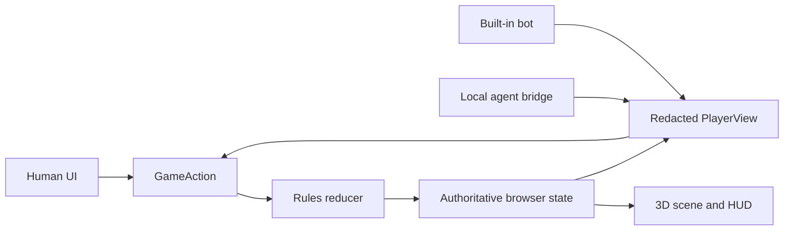
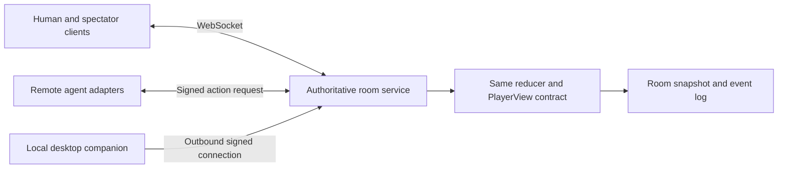

# Katan architecture

## Current local build

The browser owns one authoritative `GameState`. Every human click, built-in bot decision, and external-agent response becomes a `GameAction` and passes through the same pure `applyAction` reducer. The reducer alone changes resources, pieces, phases, awards, scores, and the event timeline.

The built-in bot receives only `PlayerView`, not `GameState`. An external process receives the same allowlisted view plus the acting seat's private hand. Opponent resource identities, development-card identities, the public island seed, and the separate private random stream are omitted. The engine validates the returned action again.

The Three.js scene is a projection of state, never a rules authority. Hexes and vertices remain invisible hit targets beneath the continuous island presentation. DOM controls provide the same placement actions for keyboard and assistive-technology users.

## Local-agent boundary

The Vite dev and preview servers proxy `/agent-api` to a bridge bound to `127.0.0.1:8787`. The bridge accepts one decision at a time, reserializes allowlisted input, caps request and process streams, uses stable error codes, aborts and waits for child termination on request cancellation or bridge shutdown, and deletes the per-request temporary directory.

`npm run bridge` is the offline heuristic. `npm run bridge:codex` launches the authenticated Codex CLI with `gpt-5.6-sol`, an ephemeral read-only sandbox, ignored user config, and both stable execution tools disabled. The browser cannot choose a command, arguments, model, path, or environment.

This is intentionally a same-device integration. A public HTTPS page cannot reliably call a loopback HTTP bridge, and the static client should not expose a local model endpoint to the internet.

## Hosted evolution

The static build can already host human-versus-bot play. Fair multi-browser rooms need an authoritative service because private hands cannot remain secret if each client owns the full state.

The migration boundary is already present:

1. Move `GameState` and `applyAction` into a room process.
2. Send each client only its `PlayerView`; spectators receive public state only.
3. Accept revisioned `GameAction` messages and reject stale revisions.
4. Let remote agents use signed HTTPS callbacks, while local agents connect outbound through a desktop companion.
5. Persist snapshots plus the public event log for reconnects and replay.

The renderer, dialogs, bot, and local-agent adapter do not need a different rules model; only the transport and state owner change.
